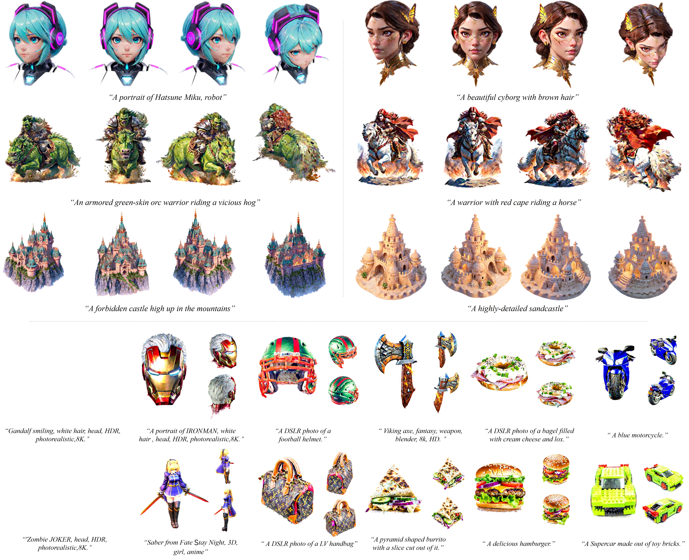

# LucidDreamer: Towards High-Fidelity Text-to-3D Generation via Interval Score Matching

[Yixun Liang](https://yixunliang.github.io/)$^{\color{red}{\*}}$ [Xin Yang](https://abnervictor.github.io/2023/06/12/Academic-Self-Intro.html)$^{\color{red}{\*}}$, [Jiantao Lin](https://ltt-o.github.io/), [Haodong Li](https://haodong-li.com/), [Xiaogang Xu](https://xiaogang00.github.io), [Yingcong Chen](https://www.yingcong.me)$^{\**}$

$\color{red}{\*}$: Equal contribution.
\**: Corresponding author.

[Paper PDF (Arxiv)](https://arxiv.org/abs/2311.11284) | [Project Page (Coming Soon)]() | [Gradio Demo](resources/Gradio_Demo.md)

---

<div align=center>
  

Note: we compress these motion pictures for faster previewing.
</div>

<div align=center>
  
  
Examples of text-to-3D content creations with our framework, the *LucidDreamer*, within **~35mins** on A100.

</div>

## :tv: Video
</div>
<div align=center>

[](https://www.youtube.com/watch?v=zToxGi_hNWs "LucidDreamer: Towards High-Fidelity Text-to-3D Generation via Interval Score Matching")

Please click to watch the 3-minute video introduction of our project.

</div>

## 🎏 Abstract

We present a text-to-3D generation framework, named the *LucidDreamer*, to distill high-fidelity textures and shapes from pretrained 2D diffusion models.

<details><summary>CLICK for the full abstract</summary>

> The recent advancements in text-to-3D generation mark a significant milestone in generative models, unlocking new possibilities for creating imaginative 3D assets across various real-world scenarios. While recent advancements in text-to-3D generation have shown promise, they often fall short in rendering detailed and high-quality 3D models. This problem is especially prevalent as many methods base themselves on Score Distillation Sampling (SDS). This paper identifies a notable deficiency in SDS, that it brings inconsistent and low-quality updating direction for the 3D model, causing the over-smoothing effect. To address this, we propose a novel approach called Interval Score Matching (ISM). ISM employs deterministic diffusing trajectories and utilizes interval-based score matching to counteract over-smoothing. Furthermore, we incorporate 3D Gaussian Splatting into our text-to-3D generation pipeline. Extensive experiments show that our model largely outperforms the state-of-the-art in quality and training efficiency.

</details>

## 🔧 Training Instructions

Our code is now released! Please refer to this [**link**](resources/Training_Instructions.md) for detailed training instructions.

## 🤗 Gradio Demo

We are currently building an online demo of LucidDreamer with Gradio, you can check it out by clicking this [link](https://huggingface.co/spaces/haodongli/LucidDreamer). It is still under development, and the service might not be available from time to time. 

## 🚧 Todo

- [x] Release the basic training codes
- [x] Release the guidance documents
- [ ] Release the training codes for more applications


## 📍 Citation 
```
@misc{EnVision2023luciddreamer,
      title={LucidDreamer: Towards High-Fidelity Text-to-3D Generation via Interval Score Matching}, 
      author={Yixun Liang and Xin Yang and Jiantao Lin and Haodong Li and Xiaogang Xu and Yingcong Chen},
      year={2023},
      eprint={2311.11284},
      archivePrefix={arXiv},
      primaryClass={cs.CV}
}
```

## Acknowledgement
This work is built on many amazing research works and open-source projects:
- [gaussian-splatting](https://github.com/graphdeco-inria/gaussian-splatting) and [diff-gaussian-rasterization](https://github.com/graphdeco-inria/diff-gaussian-rasterization)
- [Stable-Dreamfusion](https://github.com/ashawkey/stable-dreamfusion)
- [Point-E](https://github.com/openai/point-e)

Thanks for their excellent work and great contribution to 3D generation area.
